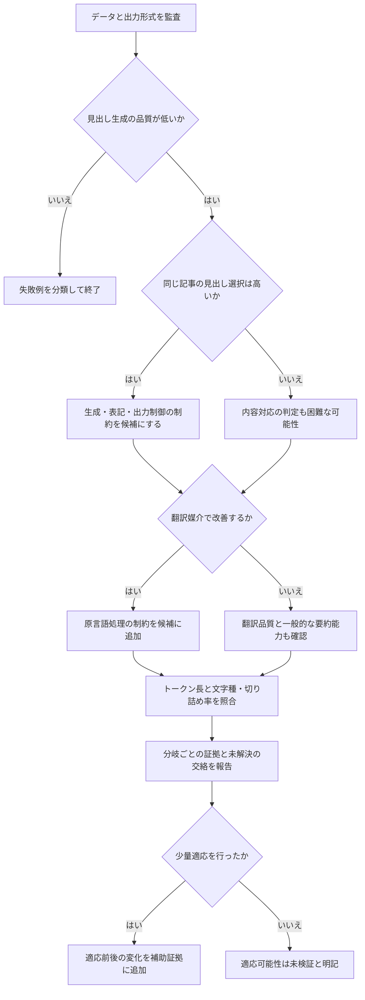

# CMHG見出し生成の失敗要因を調べる研究プロトコル

更新日：2026年9月20日。正式な実験条件は予備実験後に固定する。

## 研究として出すもの

主成果は、軽量LLMの出力を複数の課題で比較し、見出し生成失敗について説明可能な要因候補と、残る不確実性を示す診断フローである。対象はニュースと政府文書等を含む記事見出し生成であり、ニュース限定ではない。CMHG原論文は3言語のデータセットと見出し生成ベンチマークを提示している。本研究の新規性候補は、同一記事に対する生成・選択・翻訳媒介・tokenizer統計・少量適応を、事前に定めた分岐規則で組み合わせる点に置く。ただし、この組み合わせが既存研究と十分に異なるかは追加文献調査で確認する。

「診断」は因果原因の確定を意味しない。各分岐は、観測された結果と整合する説明、反証された説明、区別できない説明を記録する。

## 最小限の検証図

この図は実験後に都合よく変更しない。分岐条件と「高い」「改善」の閾値を、予備実験のあと本実験前に設定する。

## 実験の優先順位

1. データ監査、選択課題の正解率、生成品質、出力失敗率、tokenizer統計を同じ記事IDで結合する。これが核となる。
2. 翻訳媒介を実施する。言語処理に関する分岐を主張するにはこの比較が必要。ただし、翻訳器の出力品質を別に確認する。
3. QLoRAを実施する。適応可能性に関する分岐を主張するには必要だが、生成失敗の初期診断には必須ではない。16GB環境で小規模実験が成立するかを先に確認する。

追加実験が未成立の場合、対応する分岐を「未検証」として論文の図から区別する。実験なしに結果を推定しない。

## データとサンプル

- 取得元は `KEVVVV/CMHG`。取得時にrevisionを固定する。
- Hugging Faceの自動ビューアは、ファイル間の列不一致で `DatasetGenerationCastError` を表示している。全体を一括で`load_dataset`する前提を置かず、言語別CSVを個別に読み、列と行数を記録する。
- 点検は二段階に分ける。第一に取得した各CSVの全行について、列・件数・欠損・重複・ファイルハッシュ・学習用と評価用の重なりを機械的に確認する。第二に3言語それぞれ20件程度で、文字表示、tokenizer、入力長、切り詰め、推論・保存、1件あたりの時間を動作確認する。
- 20件の動作確認は性能の推定にも言語間の優劣判定にも使わない。対象言語は、文字とデータの品質、公開モデルの対応、必要時間などの実行可能性で決める。開発中に使った記事は最終評価から分離し、評価結果を見て都合のよい言語・モデルを選ばない。
- 本実験の初期目標は各言語200件。同じ記事IDを全条件で共有する。件数は1件あたりの推論時間を計測して確定し、固定後に恣意的に増減しない。
- 注釈済みの高品質サンプルを評価用候補とする。学習には使わない。論文で説明される評価集合と公開ファイルの対応はファイル監査で確認する。
- 近重複、同一見出し、本文中の見出し流入、極端な長文は事前に検査し、除外基準と件数を報告する。

## モデル

主モデルは現時点で固有名を固定しない。選定日を記録し、以下の条件を満たす公開モデルの7Bから8B級を1つ選ぶ。

- モデル重み、tokenizer、ライセンス、revisionが取得できる。
- ローカルRTX 5060 Ti 16GBで量子化推論できる。
- 3言語の入力を拒否せず、同じプロンプトで出力を保存できる。
- 同一モデルで生成と選択ができる。

モデルは本実験前に固定し、後から新モデルへ差し替えた結果を同じ比較表に混ぜない。別モデルを増やす場合は再実験として扱う。

## 見出し選択の設計

初期案は4択：正解1件、ランダム負例1件、同言語の類似話題負例2件。`genre`ラベルが公開CSVに存在するとは限らないため、ジャンル一致を初期必須条件にしない。類似話題負例は別記事の見出しから作り、正解記事と同一事件・同一見出し・同一URLでないことを確認する。

候補順は複数パターンに入れ替え、正解位置による偏りを測る。正解位置、抽出seed、候補IDを保存する。選択課題で高得点でも、候補の表面特徴や消去法を利用した可能性があるため、内容理解の証明とは扱わない。

## 翻訳媒介の設計

最初の翻訳先は中国語と仮定する。中国語は原資料の地域文脈と近く、公開モデルの対応が比較的豊富なためだが、翻訳器の品質と利用条件を確認して確定する。原言語記事を翻訳した入力と、原言語のままの入力で、同じ下流モデル・同じ記事ID・同じ評価手順を使う。翻訳器の誤訳、要約、欠落をサンプルで点検する。

翻訳媒介で改善しても、翻訳器による文章短縮、情報追加、語彙変換が影響した可能性は残る。入力token長を合わせた対照と、原文・翻訳文の保存で検討する。

## QLoRAの位置づけ

QLoRAは「追加学習により改善できるか」を調べる介入実験である。学習用と評価用の重複を排除し、同じ評価記事で適応前後を比較する。VRAM16GBで成立するかは、選定したモデル、入力長、batch、量子化実装を使って小規模に測る。成立しない場合、モデルを小さくするか、適応実験を省く。適応前後の差だけから、理解能力と表記能力のどちらが変わったかは断定しない。

## 評価とLLM判定

- 生成：ROUGE-L、chrF、空出力・文字化け・言語混在・反復などの比率。
- 選択：正解率、正解位置別正解率、無効回答率。偶然水準は4択なら25%。
- tokenizer：記事・参照見出し・生成見出しのtoken数、文字数、token/文字比、入力切り詰め率。
- 不確実性：同じ評価記事に対する条件差を、対応のあるブートストラップ区間等で報告する。
- 補助的内容評価：研究者本人がWiktionary等の辞書・LLM解説を使って少数例をレビューする。LLM判定を「正解」とは扱わず、根拠、判定不能、再判定の変化を記録する。専門読者による独立評価がないことを明記する。詳細は[補助的内容評価プロトコル](補助的内容評価プロトコル.md)。

自動指標は参照見出しとの一致を測る。意味理解そのものの尺度ではない。生成と選択では指標の単位が異なるため、数値の大小を直接比較しない。各条件の水準と失敗率の関係から診断分岐を考える。

## 締切から逆算した内部目標

| 期限 | 完了させるもの |
| --- | --- |
| 9月30日 | Python環境、データ取得方法、CSV列監査、3言語20件の点検 |
| 10月15日 | 主モデル候補の動作、選択課題の候補生成、翻訳器の候補を確認 |
| 10月31日 | 対象言語、主モデル、評価件数、分岐閾値、実験条件を固定 |
| 11月20日 | 生成・選択・tokenizerの主実験と集計を完了 |
| 12月5日 | 翻訳媒介実験と、成立する場合のQLoRA比較を完了 |
| 12月15日 | 図表、結果、考察を含む本文初稿を完成 |
| 12月24日 | APA第7版、再現性、引用、提出形式を点検 |
| 12月31日 | 最終提出日（本人申告。大学の正式要項と照合する） |

## 現在の環境

`dxdiag`：Windows 11 Home、Ryzen 7 5700X、RAM 32GB、RTX 5060 Ti、専用VRAM約16GB。`nvidia-smi`：GPU総量16,311MiB、初回確認時の空き10,772MiB。Python 3.12のローカル環境は `.venv` に用意した。`python` コマンドはWindowsApps aliasのため、実行には `.venv\Scripts\python.exe` を指定する。PyTorch 2.14.0+cu130でGPUを認識し、4-bit Qwen3-8Bで3言語各20件の生成・保存まで確認した。入力切り詰めと出力上限到達が多く、推論が通ったことを性能の証拠にはしない。詳細は[予備実験メモ](予備実験メモ.md)。

## 根拠資料

- [CMHG論文](https://aclanthology.org/2025.emnlp-main.622/)
- [CMHG公式データセット](https://huggingface.co/datasets/KEVVVV/CMHG)
- [MiLiC-Eval論文](https://aclanthology.org/2025.findings-acl.578/)
- [MC²論文](https://aclanthology.org/2024.acl-long.479/)
- [QLoRA論文](https://proceedings.neurips.cc/paper_files/paper/2023/hash/1feb87871436031bdc0f2beaa62a049b-Abstract.html)
